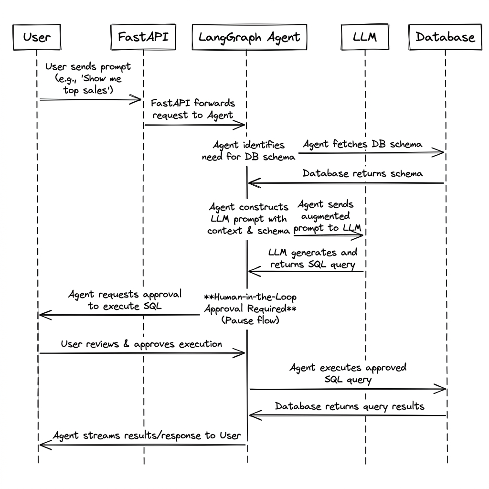

# SQL Texter AI for Datacruise

## Architecture
The system is an AI-powered Text-to-SQL API that safely executes queries against a PostgreSQL database using an agentic workflow. 
- **FastAPI** handles incoming HTTP requests and streams responses via Server-Sent Events (SSE).
- **LangGraph** orchestrates the conversational agent, handling state memory and tool execution.
- The agent dynamically fetches the database schema via **SQLAlchemy** introspection on every request.
- The **LLM** generates a SQL query based on the human prompt and the injected schema.
- **Human-in-the-loop (HITL)** middleware interrupts execution before running any SQL, allowing the user to approve, edit, or reject the generated query.
- Validated SQL is executed against the database.
- Results and intermediate tool calls are streamed back to the client in real-time.

## Architecture Diagram


## Folder Structure
```text
sql-texter-ai/
├── app/
│   ├── api/routes/      # API endpoints (chat, user)
│   ├── core/            # Database connection & config
│   ├── models/          # SQLAlchemy ORM models
│   ├── schemas/         # Pydantic validation schemas
│   └── services/        # Agent logic, LLM config, error handling
├── alembic/             # Database migration scripts
├── Dockerfile           # Docker configuration using uv
├── main.py              # FastAPI application entry point
└── pyproject.toml       # Python dependencies and metadata
```

## Features
- **Natural Language to SQL**: Converts user questions into executable SQL queries dynamically.
- **Dynamic Schema Introspection**: Reads database schemas at runtime to ensure LLM context matches the exact current table structures.
- **Human-in-the-Loop (HITL)**: Agent execution pauses before running queries, requiring explicit user approval or modification.
- **Server-Sent Events (SSE)**: Streams AI response chunks and tool execution states back to the client for low-latency feedback.
- **Fault Tolerance**: Implements `ToolRetryMiddleware` to handle transient failures or malformed LLM outputs.

## Tooling & Implementation
### Built-in / Third-Party Tools
- **FastAPI**: Core web framework for asynchronous request handling and routing.
- **LangChain & LangGraph**: Agent orchestration, state management, and LLM provider abstractions.
- **SQLAlchemy & Alembic**: Database ORM, connection pooling, and schema migrations.
- **uv**: High-performance Python package and virtual environment manager.
- **Docker**: Containerization for deployment.

### Built From Scratch
- Custom SSE streaming parser (`ask_agent_stream` / `resume_agent_stream`) to unpack LangGraph state chunks and yield `AIMessageChunk` and tool calls to the frontend.
- Human-in-the-loop interrupt and resume endpoints linked to LangGraph thread checkpoints.
- Dynamic schema injection logic that formats and prepends the live database schema into the LLM system prompt.

## Technical Choices & Tradeoffs
- **LangGraph vs Standard LangChain Agents**: Chose LangGraph for explicit control over state, checkpointer memory (`InMemorySaver`), and native Human-in-the-loop (HITL) support. The tradeoff is a steeper learning curve and slightly more boilerplate code.
- **Server-Sent Events (SSE) vs WebSockets**: SSE was chosen for streaming text and tool execution status. It is simpler to scale, load-balance, and proxy compared to persistent WebSocket connections. The tradeoff is the lack of bidirectional real-time communication over a single connection, requiring a separate `/resume` endpoint for HITL.
- **uv vs pip/poetry**: `uv` provides significantly faster dependency resolution and Docker build times. The tradeoff is that it is relatively new compared to legacy tools, though it has reached stability.
- **Direct DB Connection vs Read-Replica**: Currently, queries are executed directly on the primary database session. For production scaling, routing generated SELECT queries to a read-replica would be necessary to prevent analytical queries from impacting transactional workload performance.

## API & Live Endpoints

The API is fully deployed and can be tested live.

- **Base URL**: `https://texttosql-fgzm8h.lonch.cloud/docs`
- **Interactive Swagger Docs**: `https://texttosql-fgzm8h.lonch.cloud/docs`

### Key Endpoints to Test
You can use the Swagger UI (`/docs`) to test these endpoints directly in your browser:

1. **`GET /`**
   - **Purpose**: Server health check.
   - **Returns**: `{"status": "ok", "message": "Server health is Ok"}`

2. **`POST /api/v1/users/guest`**
   - **Purpose**: Creates a temporary guest user and a default workspace/company. 
   - **Why you need it**: You need a `user_id` to start a chat session.

3. **`POST /api/v1/chat`**
   - **Purpose**: Sends a natural language query to the AI agent.
   - **Body**: `{ "user_id": "<UUID from step 2>", "message": "show me total sales" }`
   - **Returns**: Server-Sent Events (SSE) stream. The agent will pause and request execution approval when a SQL query is generated.

4. **`POST /api/v1/chat/resume`**
   - **Purpose**: Approves or rejects the generated SQL query (Human-in-the-loop).
   - **Body**: `{ "user_id": "<UUID>", "decision": "approve" }` (Decisions can be `approve`, `edit`, or `reject`).
   - **Returns**: The execution results streamed via SSE.

## Installations

### Local Development
1. Install [uv](https://docs.astral.sh/uv/).
2. Clone the repository and navigate to the project directory.
3. Sync dependencies and start the server:
   ```bash
   uv sync
   uv run uvicorn main:app --reload --port 8000
   ```

### Docker (with Compose)
For a complete local setup including the PostgreSQL database, use Docker Compose:

1. Copy the sample environment file and fill in your API keys:
   ```bash
   cp .env.sample .env
   ```
2. Start the services (API and Database) in the background:
   ```bash
   docker-compose up -d
   ```
3. The API will be available at `http://localhost:3000`.
4. To stop and remove the containers:
   ```bash
   docker-compose down
   ```

## Contributions
Ensure you are using `uv` for dependency management. Run formatters and linters before submitting a pull request. Include tests for any new agent behaviors, middlewares, or API routes.
